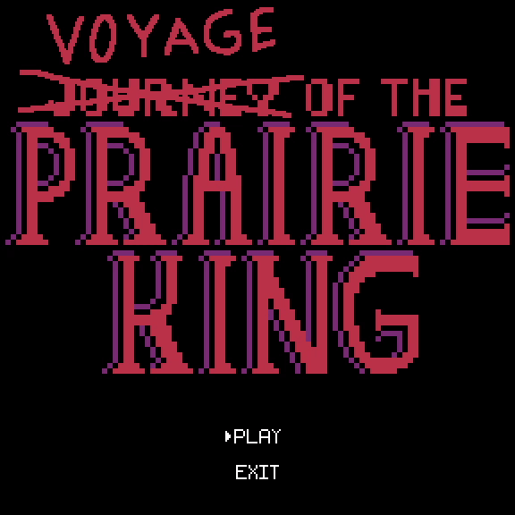
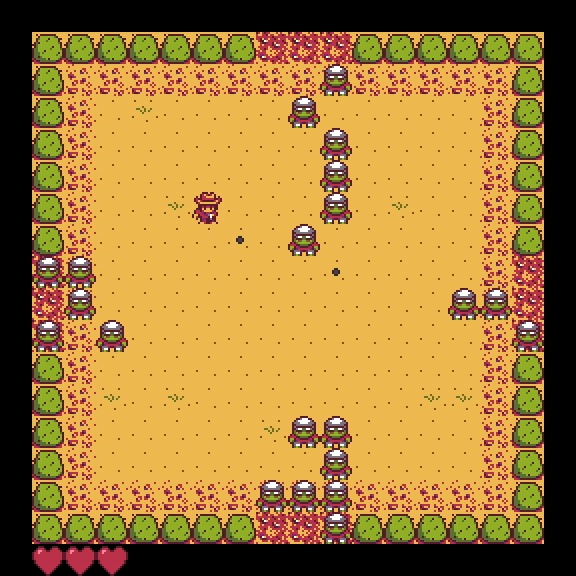
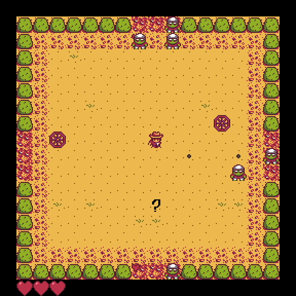
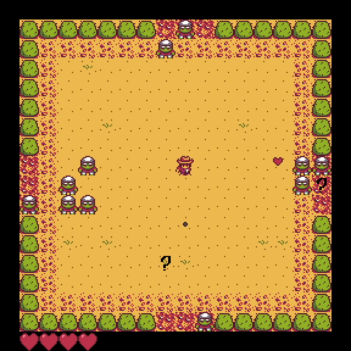
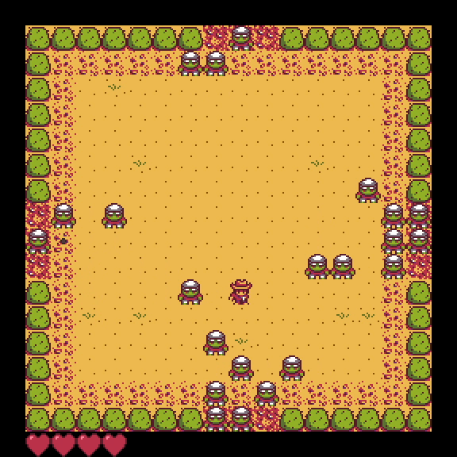

# Voyage of The Prairie King

Simples jogo inspirado em ***Journey of the Prairie King*** em que a personagem principal, o Rei, tem que fugir dos  monstros e combatê-los.
O jogo acaba quando a quantidade de vidas chega a zero mas os monstros podem *droppar* power-ups e vidas que adicionam estratégia e complexidade.

#### [Relatório Técnico](/docs/README.md)

## Como correr o programa

Para correr o programa basta executar na consola:

```
gradlew.bat run   // para Windows
./gradlew run     // para Linux
```

## Dependências

Para correr o programa é necessário a ferramente [Gradle](https://gradle.org/install/).

## Controlos
- ```W``` ```A``` ```S``` ```D``` - Para disparar em todas as direções incluindo diagonais.
- ```▲``` ```◄``` ```▼``` ```►``` - Para mover o Rei.
- ```Q``` - Parar o Jogo.

## Screenshots



Menu Showcase



Wheel Power-Up Showcase



Heart Power-Up Showcase



Confuse Power-Up Showcase



Boss Showcase

## Autores

Este projeto foi desenvolvido para a disciplina de LDTS 2022⁄23 por:
- **Henrique Filipe Pereira da Silva Caridade** (up202108817@fe.up.pt) [HenriqueFPSC](https://github.com/HenriqueFPSC)
- **Igor Cherstnev** (up202105300@fe.up.pt) [igorcherstnev](https://github.com/igorcherstnev)
- **Miguel Teixeira Lopes da Fonte** (up202108888@fe.up.pt) [MiguelFonte](https://github.com/MiguelFonte)
