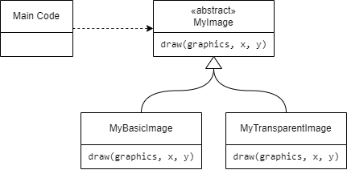

# LPOO_<06><08> - Voyage of The Prairie King

O objetivo principal do projeto é fazer um jogo, inspirado em Journey of the Prairie King em que a personagem principal, o Rei, tem que fugir dos  monstros e combatê-los.

O jogador perde o jogo quando a quantidade de vidas chega a zero, começando esta quantidade a 3, ao matar monstros estes têm uma pequena chance de “dropar” habilidades as quais o Rei pode usar.

Este projeto foi desenvolvido para a disciplina de LDTS 2022⁄23 por:
- **Henrique Filipe Pereira da Silva Caridade** (up202108817@fe.up.pt) [HenriqueFPSC](https://github.com/HenriqueFPSC)
- **Igor Cherstnev** (up202105300@fe.up.pt) [igorcherstnev](https://github.com/igorcherstnev)
- **Miguel Teixeira Lopes da Fonte** (up202108888@fe.up.pt) [MiguelFonte](https://github.com/MiguelFonte)

## Funcionalidades Implementadas

**Controlo do rei** - Através das setas é possível mover o rei para os lados, mas também diagonalmente.

**Disparar** - Quando as setas são pressionadas, o rei dispara. Também consegue disparar nas diagonais se as duas teclas da respectiva diagonal forem pressionadas.

**Nascer monstro** - Existem quatro regiões possíveis para serem gerados monstros, os quais vão atrás do Rei.

**Power-Up Confuse** - Item apanhável em que os monstros ficam a andar aleatoriamente durante um curto período de tempo.

**Apanhar vida** - Ao matar monstros estes podem dropar uma vida apanhável. (O herói só pode ter cinco vidas no máximo).

**Power-Up Disparo em todas as direções** - Ao matar monstros estes podem dropar um power-up de disparo que faz o herói disparar em todas as direções durante um curto período de tempo.

**Temporizador** - Conta os segundos desde o início da partida e funciona como pontuação.
  
## Funcionalidades Planeadas

Todas as funcionalidades planeadas foram implementadas.

## Design


### Decisão da Arquitetura.

**Contexto do Problema**

Durante o desenvolvimento do projeto chegamos a um ponto onde não usar uma Arquitetura já não era sustentável e, pela mesma razão, qualquer adição facilmente obrigava à mudança de código já escrito pois quebrava o **Open-Closed Principle** e o **Single Responsability Principle**. 

**O Padrão**

Na escolha de um Arquitetura adequada, a Arquitetura MVC(Model-View-Controller) foi a melhor escolha pois o nosso projeto benefeciaria da divisão da responsabilidade em 3 partes: informação (Model), visualização (View) e manipulação (Controller); que esta Arquitetura oferece.


**Implementação**

A implementação de cada parte da arquitetura pode ser encontrada no source code:

[Model](../scr/main/java/com/henrique/king/game)
[View](../scr/main/java/com/henrique/king/viewer)
[Controller](../scr/main/java/com/henrique/king/controller)

**Consequências**

A implementação desta Arquitetura não só facilita a modificação o programa e a adição de funcionalidades ao mesmo, mas também facilita a criação de testes para o programa.

### Dependendo do Tipo de Imagem deve Desenhar de Maneira Diferente.

**Contexto do Problema**

No programa precisámos de desenhar imagens para o ecrã e para facilitar nós decidimos criar um package auxiliar com uma classe MyImage. Mesmo assim, o programa precisava de desenhar para o ecrã imagens transparentes(onde era necessário transparência) e imagens opacas(para eficiência).

**O Padrão**
 
Para resolver esse problema usamos **Strategy** Design Pattern pois assim o método MyImage.draw(...) pode ser substituído por qualquer outro e não se notaria a diferença (interchangeable).

**Implementação**

A implementação está no package [com.henrique.image](../src/main/java/com/henrique/image)


  
**Consequências**

Usando este Design Pattern MyImage.draw(...) pode ser chamado e vai desenhar para o ecrã a imagem sem ter a preocupação do "Como?".
Também, assim, segue o **Open-Closed Principle** pois para adicionar novos tipos de imagens com maneiras diferentes de adicionar não é necessário mudar o código, basta fazer um nova classe que implementa MyImage.

### Os Inputs recebidos devem ser interpretados de maneira diferente dependendo do estado do jogo.

**Contexto do Problema**

Os inputs no menu devem ser interpretados de maneira diferente aos inputs no jogo, por exemplo, no jogo UP é para andar para cima enquanto no menu é para selecionar a opção superior.

**O Padrão**
  
A solução é usar o **State** Design Pattern e **Factory** Design Pattern onde dependendo do estado o Controller e Viewer recebidos são diferentes.
  
**Implementação**

O **State** Design Pattern foi implementado usando a classe abstrata State que tem um getViewer() e getController() que variam dependendo de que tipo de State é.

O **Factory** Design Pattern foi implementado na classe State usando a classe abstrata Viewer e a classe abstrate Controller de maneira semelhante. Na classe State getViewer() e getController() retornam um novo Objeto das classes respetivas. Quem cria os Objetos das sub-classes de Viewer e Controller é a class State.

[Código da implementação](../src/main/java/com/henrique/king/states)

No [UML geral](#design) mostra estes Padrões.
  
**Consequências**

Estes Padrões preservam o **Open-Closed Principle** pois se quiser adicionar um novo State basta criar uma nova classe que herda State e os para os Viewer e Controllers  o mesmo aplica-se e, dessa forma, facilitam a potencial expansão do código.

## Code Smells Reconhecidos e Sugestões de Refactoring

- **Bloaters**
  - **Large Class**
[Arena](../src/main/java/com/henrique/king/game/Arena.java)
  - **Large Method**
[LanternaGUI.getNextActions()](../src/main/java/com/henrique/king/gui/LanternaGUI.java)

Era possível usar o método de refactoring Extract Method para resolver estes problemas.

- **Object-Orientation Abusers**
  - **Switch Statements**
[LanternaGUI.getNextActions()](../src/main/java/com/henrique/king/gui/LanternaGUI.java)
```java
  if(bulletDir.equals(Vector2D.V_UP)){
      res.add(ACTION.SHOOT_UP);
  } else if(bulletDir.equals(Vector2D.V_DOWN)){
      res.add(ACTION.SHOOT_DOWN);
  } else if(bulletDir.equals(Vector2D.V_LEFT)){
      res.add(ACTION.SHOOT_LEFT);
  } else if(bulletDir.equals(Vector2D.V_RIGHT)){
      res.add(ACTION.SHOOT_RIGHT);
  } else if(bulletDir.equals(Vector2D.V_UP_LEFT)){
      res.add(ACTION.SHOOT_UP_LEFT);
  } else if(bulletDir.equals(Vector2D.V_UP_RIGHT)){
      res.add(ACTION.SHOOT_UP_RIGHT);
  } else if(bulletDir.equals(Vector2D.V_DOWN_LEFT)){
      res.add(ACTION.SHOOT_DOWN_LEFT);
  } else if(bulletDir.equals(Vector2D.V_DOWN_RIGHT)){
      res.add(ACTION.SHOOT_DOWN_RIGHT);
  }
  ```
  - **Refused Bequest**. A classe [Heart](../src/main/java/com/henrique/king/game/elements/items/Heart.java) nunca usa o método **ended()** de [Item](../src/main/java/com/henrique/king/game/elements/items/Item.java).
  
Para estes code smells achamos que não é preciso refactoring.
  
- **Dispensables**
  - **Duplicate Code**
  [BulletController.tick(...)](../src/main/java/com/henrique/king/controller/game/BulletController.java)
```java
  Vector2D kingPos = getModel().getKing().getPos();
  addBullet(kingPos, Vector2D.V_UP);
  addBullet(kingPos, Vector2D.V_DOWN);
  addBullet(kingPos, Vector2D.V_LEFT);
  addBullet(kingPos, Vector2D.V_RIGHT);
  addBullet(kingPos, Vector2D.V_UP_LEFT);
  addBullet(kingPos, Vector2D.V_UP_RIGHT);
  addBullet(kingPos, Vector2D.V_DOWN_LEFT);
  addBullet(kingPos, Vector2D.V_DOWN_RIGHT);
```
  - **Lazy Class**.
  [Vector2D](../src/main/java/com/henrique/king/game/Vector2D.java) apenas agrupa 2 variáveis e define poucos métodos.
  
Para estes code smells achamos que não é preciso refactoring.

- **Couplers**
  - **Message Chains**
  [GameViewer](../src/main/java/com/henrique/king/viewer/game/GameViewer.java)
  drawElements(gui)->drawElements(...)->drawElement(...)->viewer.draw(...)
```java
    @Override
    public void drawElements(GUI gui) {
        gui.drawImage(mapImg, getModel().getOrigin());
        MyBasicImage scoreImg = MyBasicImage.renderFont(Integer.toString(getModel().getScore()));
        gui.drawImage(scoreImg, new Vector2D((288 - scoreImg.getWidth()) / 2, 4));
        drawElements(gui, getModel().getDroppedItems(), new ItemViewer());
        drawElements(gui, getModel().getMonsters(), new MonsterViewer());
        drawElement(gui, getModel().getBoss(), new BossViewer());
        drawElements(gui, getModel().getBullets(), new BulletViewer());
        drawElement(gui, getModel().getKing(), new KingViewer());
        drawHearts(gui);
    }

    void drawHearts(GUI gui){
        Vector2D origin = getModel().getOrigin();
        for(int i = 0; i < getModel().getKing().getNumberOfLives(); i++)
            gui.drawImage(heartImg, origin.add(new Vector2D(16 * i, 256)));
    }

    <T extends Element> void drawElements(GUI gui, List<T> elements, ElementViewer<T> viewer) {
        for (T element : elements)
            drawElement(gui, element, viewer);
    }

    <T extends Element> void drawElement(GUI gui, T element, ElementViewer<T> viewer) {
        if(element instanceof Heart)
            viewer.draw(element, gui, getModel().getOrigin().add(new Vector2D(4, 4)));
        else
            viewer.draw(element, gui, getModel().getOrigin());
    }
```

## Testes Unitários

### Global Coverage


### Controller Coverage


### Viewer Coverage


### Model Coverage


### Mutation testing


[Resultados de Mutation Testing](./pitestMutationTesting/202212240242/index.html)

## Auto-Avaliação

Henrique Caridade : 33%

Igor Cherstnev : 33%

Miguel Fonte : 33%
